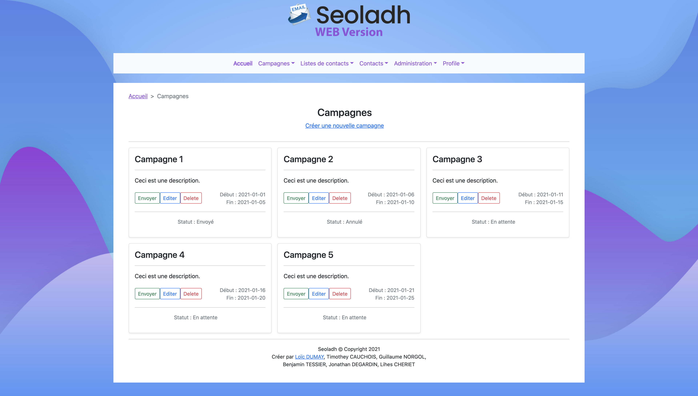

#  ESIEE-IT - Projet Seoladh

> 🚨 **Projet déplacer ici ▶▶ : [https://github.com/2023-esiee-projectlab/esiee-it_2021_seoladh](https://github.com/2023-esiee-projectlab/esiee-it_2021_seoladh)**

Bienvenue sur le git de Seoladh

Vous ci-desous un petit guide d'installation.
Vous aurez besoin cependant d'installer Ecplise la version lourde et NetBeans 8.2 pour la version Web.

## 1 - Arborescence Complète du projet

Avant toute chose, cloner le git complet dans votre espace de travail Java.
Vous trouverez le lien de l'arboresence complète du projet : [ici](https://github.com/ldumay/ESIEE-IT_Seoladh/tree/main/ReadMe_Arborescence.md)

## 2 - Version Lourde - Java JEE


Avec Eclipse, importer le projet Seoladh Java.

Dossier correspondant ci-dessous.

```
/Seoladh/
```

## 3 - Version Web - Java JEE


Avec Netbeans (Glassfish ou Tomcat pré-configurer), ouvrez simplement le projet Seoladh Java JEE.

Dossier correspondant ci-dessous.

```
/Seoladh_Web_Java_JEE/
```

### Petite présentation vidéo

[Lien](https://uploads.ldumay.fr/esiee-it/3_Seoladh/001_Demo_Video_App_Web_Beta.mp4)
