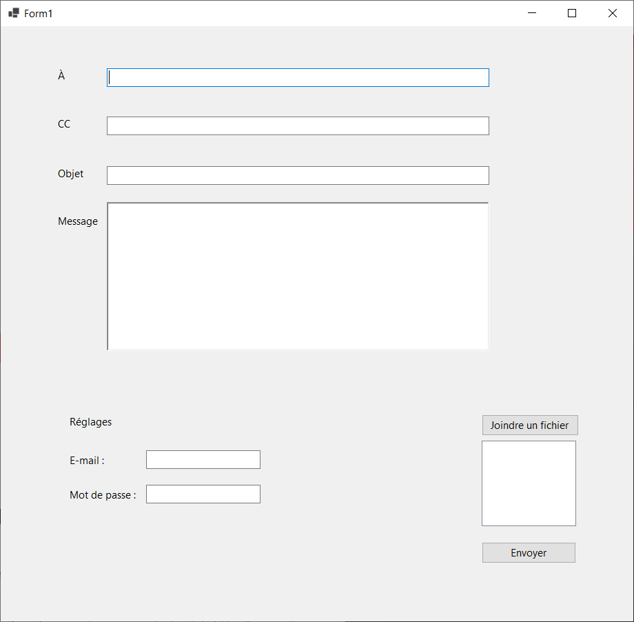

#  ESIEE-IT - Projet Seoladh

## 1 - Arborescence rapide du projet (à la main)

```
.
├── _sources_1_readme
│   ├──mail-envelope-flat-red.png
│   └── mail-open-flat.png
├── _sources_2_profs.zip
├── Devs
│   ├── Client_C
│   │   ├── Seoladh_Demo
│   │   │   ├── Attachments
│   │   │   ├── bin
│   │   │   │   └── Debug
|   │   │   │       └── netcoreapp3.1
|   │   │   │           ├── Seoladh.deps.json
|   │   │   │           ├── Seoladh.dll
|   │   │   │           ├── Seoladh.exe
|   │   │   │           ├── Seoladh.pdb
|   │   │   │           ├── Seoladh.runtimeconfig.dev.json
|   │   │   │           └── Seoladh.runtimeconfig.json
│   │   │   ├── obj
|   │   │   │   └── [non comptés]
│   │   │   ├── Seoladh
│   │   │   ├── Form1.cs
│   │   │   ├── Form1.Designer.cs
│   │   │   ├── Form1.resx
│   │   │   ├── Program.cs
│   │   │   ├── Seoladh.csproj
│   │   │   ├── Seoladh.csproj.user
│   │   │   └── Seoladh.sln
│   │   ├── Seoladh_Demo.PNG
│   │   └── Seoladh_Demo.rar
│   └── Client_JavaEE
├── 1_Projet_Seoladh.pdf
├── 2_Oktonine_Methodologies.png
└── ReadMe.md

-- directories, -- files
```

## 2 - Démo C#



La démo C# est testable dans le dossier bin\Debug\netcoreapp3.1\Seoladh.exe

Pour l'exécuter, il est requis ".NET Core Runtime" disponible dans le dossier :
```
\Devs\_Requis\.NET_Core_Runtime\.NET_Core_Runtime_v3.1.15_win64.exe
```

## 3 - Protoype Java Swing en cours de réalisation.

```
/ESIEE-IT_Seoladh/Devs/Client_Java/Seoladh_Protoype
```
Projet gérer via Netbeans 8.2.